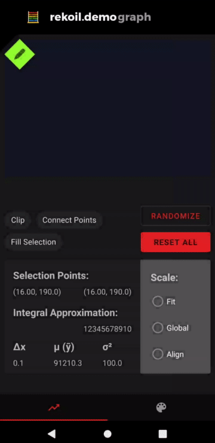

<p align="center">
    
</p>

<h1 align="center">rekoil</h1>

[](https://confluence.jetbrains.com/display/ALL/JetBrains+on+GitHub)
[](https://www.apache.org/licenses/LICENSE-2.0)


Rekoil is a reactive Kotlin API for lightweight state management as an extension of Coroutines. 

This is a companion to Kotlin and kotlinx-coroutines past the `1.3.72` release. [Multiplatform](https://github.com/Kotlin/kotlinx.coroutines#multiplatform) support is planned, but currently not tested or implemented.

This version is experimental, is likely to change, and is currently only tested on the JVM and Android. 

```kotlin
suspend fun main() = rekoilScope {
    val atom1 = atom { "Hello" }.apply {
        subscribe { println(it) }
    }

    atom1.value = "World"
}
```

> This is an unofficial Kotlin implementation of the architecture behind [facebookexperimental/Recoil](https://github.com/facebookexperimental/Recoil) (https://recoiljs.org) 

## rekoil in use

[](https://www.youtube.com/watch?v=qOR2nxB3C-k)

[Check out this example and more.](https://github.com/musotec/rekoil-examples/tree/master/rekoil-android-example)

## Motivation
The goal of this project is to simplify the creation and reactive interaction of application components
by encapsulating single sources of truth as nodes.\
These nodes are lightweight and abstract the boilerplate involved with the communication
of updates to the single source of truth across nodes that depend on it.

## Documentation

* [Changelog](CHANGELOG.md)
* Basic Guide
  * [Atoms](docs/atoms.md)
  * [Selectors](docs/selectors.md)
  * [Scopes](docs/scopes.md)
  * [Differences](docs/differences.md) (from recoil.js)
* [Dokka](docs/0.0.x/rekoil/index.md)
* Presentations and videos:
  * Official facebook experimental repo
* Facebook Experimental Recoil (Recoil.js) Reference:
  * [Recoil website](https://recoiljs.org/)
  * Official facebook experimental repo
  * [Recoil: State Management - Dave McCabe](https://youtu.be/_ISAA_Jt9kI) (ReactEurope 2020 talk)

## Using in your projects
The Rekoil library is published to [musotec's bintray](https://bintray.com/musotec/maven) repository and linked to JCenter.

<br />

<details>
<summary>👌 Maven</summary>
<p>

```xml
<dependency>
  <groupId>tech.muso.rekoil</groupId>
  <artifactId>rekoil</artifactId>
  <version>0.0.3</version>
</dependency>
```

</p>
</details>

### Gradle

Add dependencies. (Currently built against Kotlin version `1.3.72`) \
Note that `kotlin-stdlib` must be included in your project. However, the `kotlinx-coroutines` library does not.
When this project changes to versions 1.4.0 and higher, the kotlin-stdlib will be included by the coroutines library.

```groovy
dependencies {
    implementation("tech.muso.rekoil:rekoil:0.0.3")
}
```

Make sure that you have `jcenter()` in the list of repositories:
```groovy
repository {
    jcenter()
}
```

### Android

Add [`kotlinx-coroutines-android`](https://github.com/Kotlin/kotlinx.coroutines#android) module as dependency when using Rekoil on Android:
```groovy
implementation 'org.jetbrains.kotlinx:kotlinx-coroutines-android:1.3.7'
```

Additionally, to prevent leakage of coroutines and channels within this library 
you should pass an Android CoroutineScope when creating your RekoilScope.

For [ViewModelScope](https://developer.android.com/topic/libraries/architecture/coroutines#viewmodelscope),
use `androidx.lifecycle:lifecycle-viewmodel-ktx:2.1.0-beta01` or higher.\
For [LifecycleScope](https://developer.android.com/topic/libraries/architecture/coroutines#lifecyclescope),
use `androidx.lifecycle:lifecycle-runtime-ktx:2.2.0-alpha01` or higher.

Then use as such:
```kotlin
val rekoilScope = RekoilScope(viewModelScope).launch {
    // your rekoil code here
}
```

### Multiplatform

Rekoil only uses the Core modules of `kotlinx.coroutines`, so that it will be available for 
[Kotlin/JS](#js) and [Kotlin/Native](#native).

However, due to technical debt, I have not yet tested this. However, if you wish to compile and 
use on another platform, you should be able to add the necessary dependencies yourself.

The oldest version of Kotlin this source code should be compatible with is version `1.3.20`.
But versions below `1.3.71` are untested and unsupported. Version `1.3.20` is likely to only work on the JVM.

## Planned Updates

[Yes](docs/todo.md)